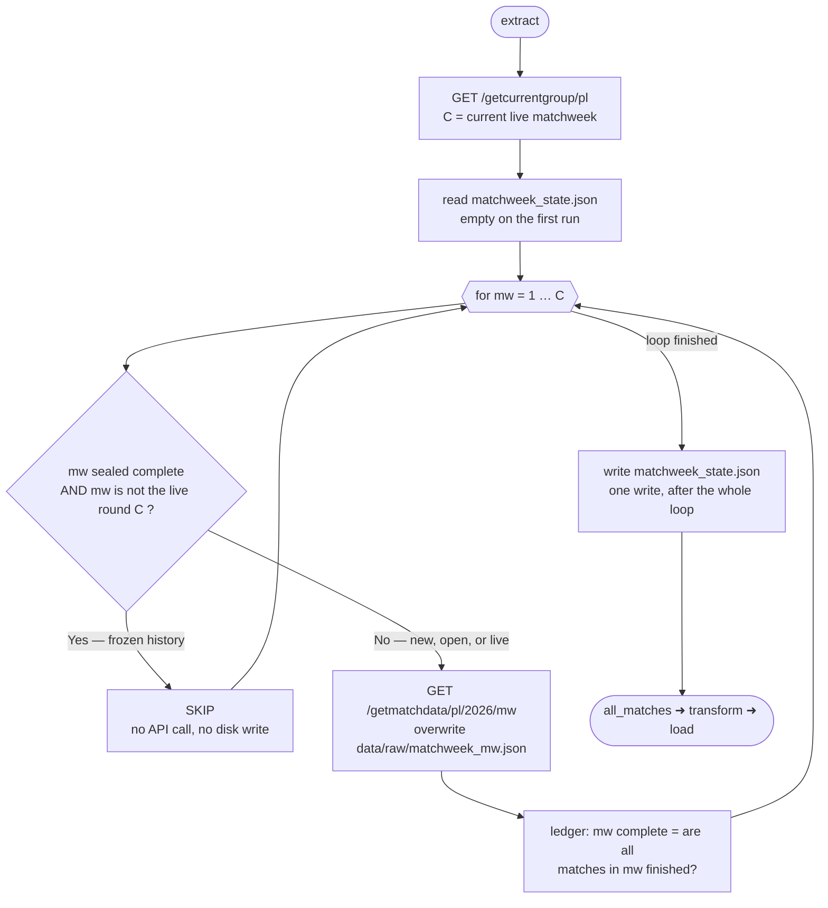

# Premier League 2026/27 — Data Product

An end-to-end data product that extracts live Premier League match data from the OpenLigaDB API, transforms it into analytical outputs, and presents insights through an interactive Streamlit dashboard.

---

## Project Overview

This project tracks the **Premier League 2026/2027 season** in near real-time. It pulls match results as they become available, builds a clean analytical dataset, computes a full league table with derived metrics, and serves everything through a business-facing Streamlit application.

**Selected API:** [OpenLigaDB](https://api.openligadb.de) — a free, keyless, community-driven sports API covering major European football leagues. No registration, API key, or credentials are required.

**Why this API and use case:** Football league data is inherently well-structured (fixed teams, weekly matchweeks, standardised scoring) yet rich enough to demonstrate meaningful ETL logic: incremental extraction, idempotent upserts, derived standings, and data quality checks on an evolving dataset.

---

## How to Run

```bash
git clone https://github.com/roni45455/premier-league-data-product-main.git
cd premier-league-data-product-main
python -m venv .venv

# Windows
.venv\Scripts\activate

# macOS / Linux
source .venv/bin/activate

pip install -r requirements.txt
python etl.py
streamlit run app.py
```

No API key, Docker, external database, or manual file preparation is required. The ETL fetches data directly from the public API and persists it locally.

---

## Repository Structure

```
├── README.md                   # This file
├── requirements.txt            # Python dependencies
├── etl.py                      # Main ETL entry point
├── app.py                      # Streamlit application
├── /src/                       # Supporting modules
│   ├── extract.py              # API extraction logic
│   ├── transform.py            # Data cleaning and normalisation
│   ├── load.py                 # Deduplication, sorting, CSV persistence
│   └── analysis.py             # Analytical layer (standings, form, metrics)
├── /data/
│   ├── /raw/                   # Raw JSON extracts per matchweek
│   └── /processed/             # Processed analytical output (matches.csv)
├── /tests/                     # Unit tests
│   └── test_project_paths.py   # Path-resolution sanity checks
└── /ai_transcript/             # Full AI conversation transcript
```

---

## Architecture & ETL Design

The pipeline follows a classic **Extract → Transform → Load** pattern, orchestrated by `etl.py`:

### Extract (`src/extract.py`)

Connects to the OpenLigaDB REST API and retrieves match data matchweek by matchweek up to the current live round.

- **Incremental extraction:** A local state file (`data/raw/matchweek_state.json`) tracks which matchweeks are fully complete. Completed matchweeks are skipped on subsequent runs, reducing API calls and runtime.
- **Idempotent re-fetching:** The current (in-progress) matchweek is always re-fetched to capture newly finished matches and score corrections.
- **Raw persistence:** Every fetched matchweek is saved as a standalone JSON file under `data/raw/`, preserving the exact API response for reproducibility and debugging.
- **Error handling:** Network failures from the `requests` library propagate clearly; the state file is only updated after a successful fetch, so a failed run does not corrupt the ledger.

### Transform (`src/transform.py`)

Cleans and normalises the raw API payload into a flat, analysis-ready structure:

- Filters out unfinished matches (only completed results are carried forward).
- Extracts the final score from the nested `matchResults` array, specifically the `After90Minutes` result type.
- Derives outcome labels (`Home win`, `Away win`, `Draw`) from the perspective of the home team.
- Splits the UTC kickoff timestamp into separate `match_date` (DD-MM-YYYY) and `kickoff_time` (HH:MM) columns.
- Computes `total_goals` and `goal_difference` per match.
- Skips matches that are marked finished but lack a valid final result (a defensive guard against API inconsistencies).

### Load (`src/load.py`)

Persists transformed data to `data/processed/matches.csv` with upsert semantics:

- **Natural key deduplication:** Each match is uniquely identified by `(matchweek, home_team, away_team)`. When the ETL runs again and re-fetches a matchweek, the newer version of a fixture replaces the older one based on `last_update`.
- **Chronological sorting:** Output is sorted by matchweek and then by kickoff datetime, even though the date is stored in DD-MM-YYYY display format.
- **Append-safe:** If `matches.csv` already exists, new data is merged with existing data rather than overwriting, ensuring previously loaded matchweeks are preserved.

### Analyse (`src/analysis.py`)

A pure, stateless analytical layer sitting between the stored CSV and the dashboard. It is imported by `app.py` (not by `etl.py`) and runs at render time, so re-slicing the data never requires re-running the ETL:

- **Team-perspective reshaping:** `build_team_matches()` unpivots each match row into two team-level rows (home and away), each carrying `goals_for`, `goals_against`, `result` (W/D/L) and `points`. Every downstream metric is computed from this single reshaped frame.
- **League table:** `compute_league_table()` aggregates team rows into standings (MP, W, D, L, GF, GA, GD, Pts) sorted by points, then goal difference, then goals for.
- **Form and sequence metrics:** chronological form (`get_team_form`), overall and conditional points-per-game (`compute_ppg_metrics`, e.g. PPG after a win), bounce-back rate after a loss (`compute_bounce_back`), and a 3×3 result transition matrix `P(result_t | result_t-1)` (`compute_transition_matrix`).
- **Team profiling:** goals scored/conceded trend (`compute_goals_trend`), clean sheet rate (`compute_clean_sheet_rate`), and a home vs away split (`compute_home_away_split`).
- **Data quality summary:** `compute_data_quality()` surfaces matchweeks loaded, matches per matchweek (flagging any with fewer than 10 fixtures), missing values per column, and the latest `last_update` — exposing the pipeline's health directly in the dashboard.

### Data Flow Diagram

```
  ┌─ BATCH ─ etl.py ──────────────────────────────────────────────┐
  │                                                               │
  │    OpenLigaDB API                                             │
  │         │                                                     │
  │         ▼                                                     │
  │    ┌────────────┐     ┌────────────────────────┐              │
  │    │  Extract   │────▶│  data/raw/             │              │
  │    │ extract.py │     │  matchweek_N.json      │              │
  │    └────────────┘     │  matchweek_state.json  │              │
  │         │             └────────────────────────┘              │
  │         ▼                                                     │
  │    ┌────────────┐                                             │
  │    │ Transform  │  filter unfinished, flatten nested payload, │
  │    │transform.py│  derive result / total_goals / goal_diff    │
  │    └────────────┘                                             │
  │         │                                                     │
  │         ▼                                                     │
  │    ┌────────────┐     ┌────────────────────────┐              │
  │    │    Load    │────▶│  data/processed/       │              │
  │    │  load.py   │     │  matches.csv           │              │
  │    └────────────┘     └────────────────────────┘              │
  │                                  │                            │
  └──────────────────────────────────┼────────────────────────────┘
                                     │  matches.csv is the contract
  ┌─ READ-TIME ─ app.py ─────────────┼────────────────────────────┐
  │                                  ▼                            │
  │    ┌────────────┐     ┌────────────────────────┐              │
  │    │  Analysis  │◀────│  matches.csv           │              │
  │    │ analysis.py│     └────────────────────────┘              │
  │    └────────────┘                                             │
  │         │  match rows ─▶ team rows ─▶ league table, form,     │
  │         │  PPG, bounce-back, transition matrix, clean sheets, │
  │         │  home/away split, data-quality summary              │
  │         ▼                                                     │
  │    ┌────────────┐                                             │
  │    │ Streamlit  │  renders tables & charts,                   │
  │    │   App      │  cached via st.cache_data                   │
  │    └────────────┘                                             │
  │                                                               │
  └───────────────────────────────────────────────────────────────┘
```

`etl.py` owns the batch half (Extract → Transform → Load) and writes `matches.csv`.
`app.py` owns the read half: it loads that CSV once, hands it to `analysis.py`, and
renders the returned frames. The two halves are decoupled — the dashboard can be
restarted, re-filtered and re-rendered without issuing a single API call, and the
analytical layer is pure (no I/O, no state), so every metric is reproducible from
the CSV alone.

### Control Flow Diagram: Incremental Extraction

The data flow above shows *where data goes*. This diagram shows *how `extract()` decides what to fetch* — the one genuinely stateful, non-trivial part of the pipeline. A football season is a moving target: past matchweeks are immutable history, the current matchweek is a live document that changes several times a weekend, and future matchweeks do not exist yet. The extractor has to tell these three cases apart on every single run, using nothing but a small JSON ledger it wrote to itself last time.



*(The diagram renders as a flowchart on GitHub and in any Mermaid-aware viewer.)*

#### Why this is harder than it looks

- **A matchweek has three states, not two.** *Unfetched*, *open* (fetched, but some fixtures unplayed) and *sealed* (all fixtures finished **and** the live pointer `C` has moved past it). Only the third state earns a skip. The ledger stores just one boolean, so the second condition — `mw != C` — has to be re-evaluated against the live API on every run; a matchweek that was sealed on Sunday is still re-read on Monday if the league has not rolled over yet.
- **The live matchweek is deliberately re-fetched even when the ledger says complete.** The final whistle is not the last word: OpenLigaDB back-fills late results and pushes score corrections, bumping `lastUpdateDateTime` after the fact. Trusting the flag would freeze a provisional scoreline into `matches.csv`. The cost is exactly one redundant request per run; the benefit is never publishing a stale table.
- **Idempotency has to hold at three layers, not one.** The raw JSON file is overwritten rather than appended, the accumulator returns only what was actually fetched this run, and the load step upserts on the natural key `(matchweek, home_team, away_team)` keeping the latest `last_update`. Running the ETL once or fifty times in a day produces a byte-identical `matches.csv`.
- **Failure is atomic by construction.** The ledger is written **once**, after the loop completes. A network exception on matchweek 7 propagates out before that write, so nothing is sealed and the next run simply re-fetches from where the last successful ledger left off. A per-iteration write would risk sealing a matchweek whose JSON never reached disk.
- **The payoff compounds across the season.** Without state, every run costs `C` requests and grows linearly to 38. With it, a steady-state run costs 2: one for the live pointer, one for the open matchweek. The current ledger shows matchweeks 1 and 2 sealed and matchweek 3 open — 2 API calls instead of 4, a gap that widens every week.
- **The deliberate trade-off.** Nothing ever re-opens a sealed matchweek, so a retroactive correction to an old result is not picked up. This is accepted on purpose: such corrections are rare, and the escape hatch is cheap — delete `data/raw/matchweek_state.json` and the next run performs a full re-fetch, which the natural-key upsert in the load step makes completely safe.

---

## Dashboard / Application Overview

The Streamlit app (`app.py`) reads the processed `matches.csv` and presents the following views:

- **League Table:** A computed standings table showing each team's matches played, wins, draws, losses, goals for, goals against, goal difference, and total points — sorted by points and goal difference, mirroring the official Premier League ranking rules.
- **Match Results:** A filterable table of all completed fixtures with matchweek and team selectors.
- **Goal Statistics:** Aggregated metrics such as total goals scored, average goals per match, highest-scoring fixtures, and goals per matchweek trend.
- **Home vs Away Performance:** Analysis of home advantage — win rates, average goals, and result distribution split by venue.
- **Interactive Filters:** Sidebar controls for matchweek range and team selection that dynamically update all views.

---

## Data Quality Checks & Validation

The pipeline includes several layers of defensive logic:

- **Unfinished match filtering:** Only matches with `matchIsFinished == true` are carried into the analytical layer. Scheduled or in-progress fixtures are excluded to avoid publishing partial scores.
- **Missing result guard:** Even if a match is flagged as finished, the transform step verifies that a valid `After90Minutes` result object exists before processing. Matches without one are skipped and logged.
- **Duplicate prevention:** The load step deduplicates on the natural key `(matchweek, home_team, away_team)`, keeping only the most recently updated version of each fixture. This handles both re-runs and mid-matchweek score corrections.
- **Date parsing robustness:** Datetime conversion uses `errors="coerce"` to avoid crashes on malformed timestamps; any unparseable rows would sort to the end rather than breaking the pipeline.
- **State file integrity:** The matchweek state ledger is written only after all matches for a matchweek are fetched, preventing half-written state on network failures.
- **Goal consistency:** Derived fields (`total_goals`, `goal_difference`, `result`) are computed from the same source values, eliminating the risk of mismatched aggregations.

---

## Assumptions & Known Limitations

- **API availability:** OpenLigaDB is a community project with no SLA. If the API is down, the ETL will fail on the extraction step. Previously cached raw data and processed outputs remain intact.
- **Season scope:** The ETL is configured for the 2026/2027 Premier League season (`LEAGUE = "pl"`, `SEASON = 2026`). Adjusting these constants would point it at a different season or league.
- **No goal-scorer detail:** The API provides goal events, but scorer names and minute data are frequently missing or zeroed out in this league's feed. The current transform does not surface goal-level detail for this reason.
- **UTC timestamps:** All kickoff times are stored in UTC. The dashboard does not convert to local time zones.
- **No live/streaming updates:** The ETL is a batch process. It captures a snapshot each time it runs; it does not stream live score updates.
- **Streamlit dependency:** The requirements file pins `pandas` and `requests` but relies on the user installing a compatible Streamlit version (any recent release should work).

---

## AI Usage

An AI assistant (Claude) was used throughout the development of this project. The full conversation transcript is included in the `/ai_transcript/` directory.

Key areas where AI was used:

- **Assignment breakdown:** Clarifying the assignment requirements and deciding on the API, product direction, and scope.
- **API selection:** Evaluating free API options (OpenLigaDB, football-data.org, Open-Meteo) and choosing one that offered keyless access and rich enough data for meaningful ETL.
- **ETL architecture:** Designing the incremental extraction strategy with the matchweek state ledger, the natural-key deduplication logic in the load step, and the transform field derivations.
- **Code generation and refinement:** Generating initial module code, then iterating on edge cases (e.g., handling matches marked finished without a final result, sorting DD-MM-YYYY dates correctly).
- **Data quality:** Identifying potential failure modes (API downtime, duplicate rows on re-runs, partial matchweeks) and building defensive checks.
- **README and documentation:** Structuring this README to cover all required sections clearly.

AI output was reviewed, tested, and adjusted at each stage — not accepted verbatim.

---

## What I Would Improve With More Time

- **Richer analytics:** Add team-level trend charts (form over last N matches), head-to-head records, and expected points models.
- **Goal-level detail:** Parse and surface individual goal events where the API provides scorer and minute data, enabling top-scorer tables and goal-timing analysis.
- **Automated scheduling:** Wrap the ETL in a cron job or GitHub Action to run automatically after each matchweek.
- **Testing coverage:** Expand unit tests beyond path checks to cover transform logic (edge cases like 0-0 draws, missing results) and load deduplication behaviour.
- **Error alerting:** Add structured logging and optional notifications (e.g., Slack webhook) when the ETL encounters API errors or data quality anomalies.
- **Multi-season support:** Allow the user to select a season from the dashboard, comparing performance across years.
- **Caching layer:** Introduce a lightweight SQLite database instead of flat CSV to support faster queries and richer joins as data grows.